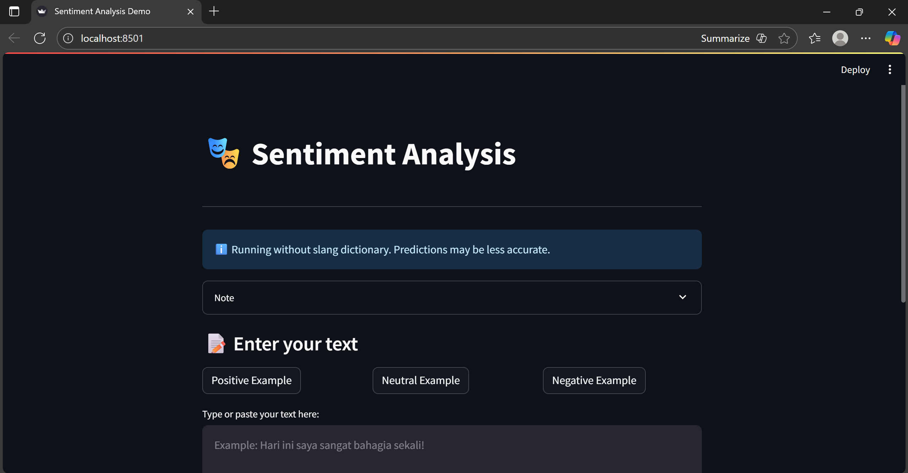

# Indonesian Sentiment Analysis 

<div align="center">


A machine learning sentiment analysis for Indonesian text, built with Streamlit and scikit-learn.

</div>

---

## 🎯 About The Project

This project is a **sentiment analysis application** specifically designed for **Indonesian language** text. It analyzes user input and classifies the sentiment as **Positive**, **Negative**, or **Neutral** with confidence scores.

- **Indonesian Language Focus**: Specifically tailored for Indonesian text preprocessing
- **Machine Learning**: Uses Logistic Regression with TF-IDF vectorization
- **Real-time Analysis**: Instant sentiment prediction with confidence scores
- **Comprehensive Preprocessing**: Includes slang normalization, stemming, and stopword removal

---

## ✨ Features

### Current Features 
- [x] **Three-class Classification** - Positive, Negative, and Neutral sentiments
- [x] **Confidence Scores** - View probability distribution across all classes
- [x] **Text Preprocessing Pipeline**
  - Twitter-specific cleaning (mentions, hashtags, URLs)
  - Emoji removal
  - Slang normalization
  - Stopword removal
  - Stemming (Sastrawi)
  - Capital ratio feature extraction

---

## 🎬 Demo on Local




---

## 🛠️ Technology Stack

### Core Technologies

- **Python 3.8+** - Programming language
- **Streamlit** - Web application framework
- **scikit-learn** - Machine learning library
- **pandas** - Data manipulation
- **NLTK** - Natural language processing

### NLP Libraries

- **Sastrawi** - Indonesian stemmer
- **TextBlob** - Text processing
- **NLTK Stopwords** - Stopword removal

### Machine Learning

- **TF-IDF Vectorization** - Text feature extraction
- **Logistic Regression** - Classification model
- **scipy** - Sparse matrix operations

---

## 📦 Installation

### Prerequisites

- Python 3.8 or higher
- pip (Python package manager)
- Git

### Step-by-Step Installation

#### 1. Clone the Repository

```bash
git clone https://github.com/AmeliaSyahla/sentiment-analysis.git
cd sentiment-analysis
```

#### 2. Create Virtual Environment (Recommended)

```bash
# Windows
python -m venv .venv
.venv\Scripts\activate

# macOS/Linux
python3 -m venv .venv
source .venv/bin/activate
```

#### 3. Install Dependencies

```bash
pip install -r requirements.txt
```

#### 4. Download NLTK Data

```python
python -c "import nltk; nltk.download('punkt'); nltk.download('stopwords')"
```

#### 5. Prepare Required Files

Ensure you have these files in your project directory:

```
sentiment_analysis/
├── Assets/
│   ├── Fix_Final_Berita_dan_Tweet.csv     # Your dataset
│   ├── full_lexicon.csv                    # Sentiment lexicon
│   └── combined_slang_words.txt           # Slang dictionary (optional)
├── app.py
├── train_model.py
└── requirements.txt
```

---

## 🚀 Usage

### Training the Model

Before using the application, you need to train the sentiment analysis model:

```bash
python train_model.py
```

**This will generate:**
- `model.pkl` - Trained Logistic Regression model
- `vectorizer.pkl` - TF-IDF vectorizer
- `model_config.json` - Model configuration

### Running the Web Application

```bash
streamlit run app.py
```

The application will open in your default browser at `http://localhost:8501`

---
